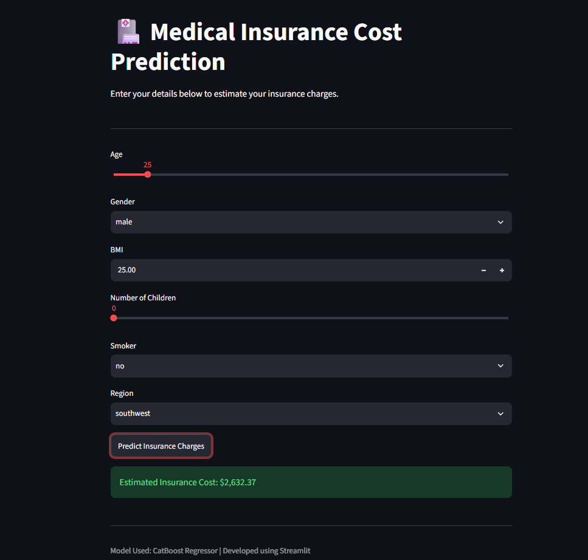

# Medical Insurance Cost Prediction Model

This project is a Streamlit web application that predicts medical insurance charges based on user input such as age, gender, BMI, number of children, smoking status, and region.

## Overview

The app uses a trained regression model to estimate insurance costs. It provides a simple and interactive interface where users can enter their details and receive an estimated insurance premium.

## Features

- Predict insurance charges from user input
- Interactive web interface built with Streamlit
- Supports input validation and instant prediction
- Displays the estimated cost in a clear, user-friendly format

## Tech Stack

- Python
- Streamlit
- Pandas
- Scikit-learn
- CatBoost
- XGBoost
- Pickle for model loading

## Project Files

- app.py - Main Streamlit application
- requirements.txt - Python dependencies
- medical_insurance_model.pkl - Trained model file
- scaler_medical.pkl - Feature scaler file

## Installation

1. Clone the repository
2. Install the required dependencies:

```bash
pip install -r requirements.txt
```

3. Make sure the model files are present in the project directory:
   - medical_insurance_model.pkl
   - scaler_medical.pkl

## Usage

Run the application with:

```bash
streamlit run app.py
```

Then open the local URL shown in the terminal in your browser.

## App Preview



## Live Demo

[Live Demo](https://medicalinsurance-cost-prediction-model-ea5eysy6mqz6ds3shgfztt.streamlit.app/)

## Example

The app asks for:

- Age
- Gender
- BMI
- Number of children
- Smoking status
- Region

Based on these values, it provides an estimated insurance cost.

## Notes

This application is intended for demonstration and educational purposes. The predictions are based on the trained model and may not reflect real-world insurance pricing exactly.
